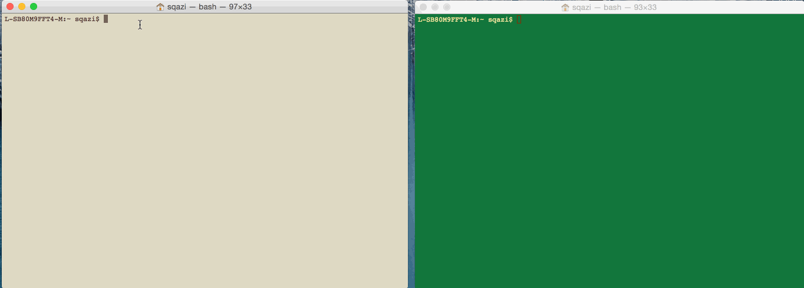

# Pre-work: Proxy-Server

This is a Proxy Server for Node.js submitted as the [pre-work](http://courses.codepath.com/snippets/intro_to_nodejs/prework) requirement for CodePath.

Time spent: 6 hours to setup the environment. 2 hours to build the proxy server.

Completed:

* [] Required: Requests to port `8000` are echoed back with the same HTTP headers and body
* [] Required: Requests/reponses are proxied to/from the destination server
* [] Required: The destination server is configurable via the `--host`, `--port`  or `--url` arguments
* [] Required: The destination server is configurable via the `x-destination-url` header
* [] Required: Client requests and respones are printed to stdout
* [] Required: The `--logfile` argument outputs all logs to the file specified instead of stdout

Will try in next version:

* [] Optional: The `--exec` argument proxies stdin/stdout to/from the destination program
* [] Optional: The `--loglevel` argument sets the logging chattiness
* [] Optional: Supports HTTPS
* [] Optional: `-h` argument prints CLI API

Walkthrough Gif:
[Add walkthrough.gif to the project root]



Note: to embed the gif file, just check your gif file into your repo and update the name of the file above.

## Starting the Server

```bash
bode index.js

L-SB80M9FFT4-M:proxy-server sqazi$ bode index.js
```

## Features

### Echo Server:

```bash
curl -v -X POST http://127.0.0.1:8000 -d "hello self" -H "x-asdf: yodawg"

L-SB80M9FFT4-M:proxy-server sqazi$ curl -v -X POST http://127.0.0.1:8lo self" -H "x-asdf: yodawg"
* Rebuilt URL to: http://127.0.0.1:8000/
*   Trying 127.0.0.1...
* Connected to 127.0.0.1 (127.0.0.1) port 8000 (#0)
> POST / HTTP/1.1
> Host: 127.0.0.1:8000
> User-Agent: curl/7.43.0
> Accept: */*
> x-asdf: yodawg
> Content-Length: 10
> Content-Type: application/x-www-form-urlencoded
> 
* upload completely sent off: 10 out of 10 bytes
< HTTP/1.1 200 OK
< host: 127.0.0.1:8000
< user-agent: curl/7.43.0
< accept: */*
< x-asdf: yodawg
< content-length: 10
< content-type: application/x-www-form-urlencoded
< Date: Sat, 22 Aug 2015 01:18:02 GMT
< Connection: keep-alive
< 
* Connection #0 to host 127.0.0.1 left intact
hello self
```

### Proxy Server:

Echo Server: Port 8000
Proxy Server: Port 8001
Port 8001 will proxy to the echo server on port 8000.

Echo request: 
{"host":"127.0.0.1:8000","user-agent":"curl/7.43.0","accept":"*/*","x-asdf":"yodawg","content-length":"10","content-type":"application/x-www-form-urlencoded"}hello self

### Configuration:

#### CLI Arguments:

The following CLI arguments are supported:

##### `--host`

The host of the destination server. Defaults to `127.0.0.1`.

##### `--port`

The port of the destination server. Defaults to `80` or `8000` when a host is not specified.

##### `--url`

A single url that overrides the above. E.g., `http://www.google.com`

##### `--logfile`

Specify a file path to redirect logging to.

#### Headers

The follow http header(s) are supported:

##### `x-destination-url`

Specify the destination url on a per request basis. Overrides and follows the same format as the `--url` argument.
